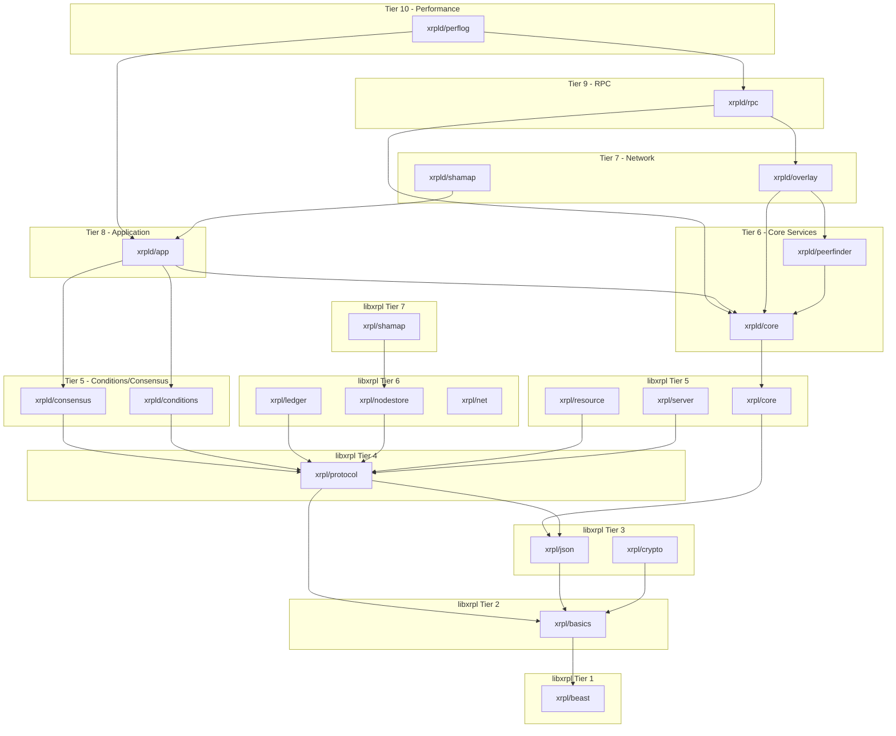
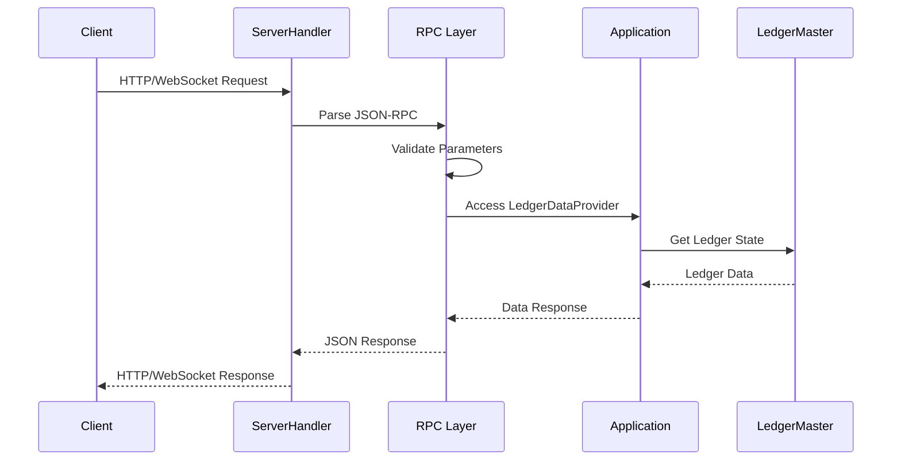
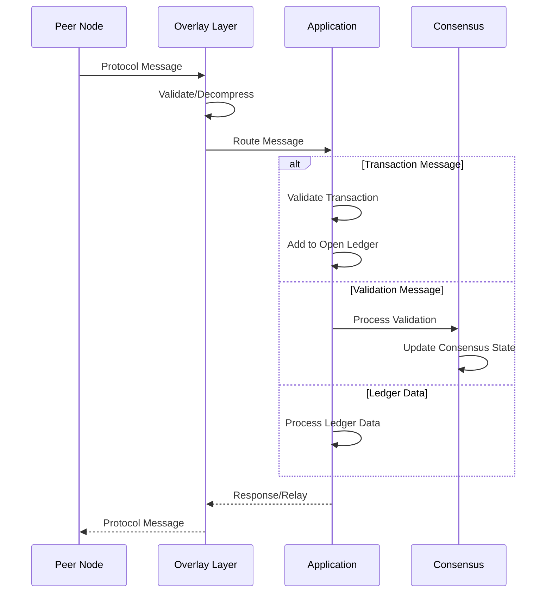

# rippled Architecture Guide

This document provides a comprehensive guide to the rippled codebase architecture for new developers.

## Table of Contents

1. [High-Level Overview](#high-level-overview)
2. [Module Structure](#module-structure)
3. [Key Subsystems](#key-subsystems)
4. [Threading Model](#threading-model)
5. [Build System](#build-system)
6. [Levelization (Dependency Rules)](#levelization-dependency-rules)
7. [Dependency Inversion Patterns](#dependency-inversion-patterns)
8. [Module Responsibilities](#module-responsibilities)
9. [Adding New Features](#adding-new-features)
10. [Testing Architecture](#testing-architecture)
11. [Appendix: Architecture Diagrams](#appendix-architecture-diagrams)

---

## High-Level Overview

### System Purpose

rippled is the reference server implementation for the **XRP Ledger (XRPL)**, a decentralized cryptographic ledger designed for fast, low-cost international payments. The server:

- Participates in the peer-to-peer network
- Validates and processes transactions
- Maintains a complete or partial copy of the ledger
- Provides JSON-RPC and WebSocket APIs for clients
- Participates in the consensus process (if configured as a validator)

### Core Components

```
┌─────────────────────────────────────────────────────────────────────────┐
│                           Client Applications                            │
│                    (Wallets, Exchanges, dApps)                           │
└───────────────────────────────┬─────────────────────────────────────────┘
                                │ JSON-RPC / WebSocket / gRPC
┌───────────────────────────────▼─────────────────────────────────────────┐
│                            RPC Layer                                     │
│                   (src/xrpld/rpc/)                                      │
└───────────────────────────────┬─────────────────────────────────────────┘
                                │
┌───────────────────────────────▼─────────────────────────────────────────┐
│                         Application Layer                                │
│    ┌──────────────┐  ┌──────────────┐  ┌──────────────────────────┐     │
│    │ NetworkOPs   │  │ LedgerMaster │  │ Transaction Processing   │     │
│    │ (Operations) │  │ (Ledger Mgmt)│  │ (Transactors)            │     │
│    └──────────────┘  └──────────────┘  └──────────────────────────┘     │
│                        (src/xrpld/app/)                                  │
└───────────────────────────────┬─────────────────────────────────────────┘
                                │
┌──────────────────┬────────────┴────────────┬────────────────────────────┐
│   Consensus      │       Overlay           │        Storage             │
│   (RPCA)         │    (P2P Network)        │      (NodeStore)           │
│ src/xrpld/       │   src/xrpld/            │   src/libxrpl/             │
│ consensus/       │   overlay/              │   nodestore/               │
└──────────────────┴─────────────────────────┴────────────────────────────┘
```

### Data Flow

1. **Transaction Submission**: Client submits via RPC → Validated → Added to Open Ledger → Broadcast to peers
2. **Consensus**: Validators propose → Negotiate → Agree on transaction set → Close ledger
3. **Ledger Storage**: Validated ledger → Serialized to SHAMap → Persisted to NodeStore
4. **Peer Sync**: New peer connects → Requests missing ledgers → Validates and stores

### Design Principles

1. **Levelization**: Modules are organized into tiers; higher tiers depend on lower tiers, never the reverse
2. **Separation of Concerns**: Public interfaces (`include/xrpl/`) are separate from implementation (`src/xrpld/`)
3. **Dependency Inversion**: High-level modules depend on abstractions, not concrete implementations
4. **Composition over Inheritance**: Factory functions and composition are preferred over deep inheritance hierarchies

---

## Module Structure

### libxrpl (Reusable Library)

The library layer provides reusable components that can be used independently of the daemon:

| Module        | Location                 | Purpose                                                                                                                    |
| ------------- | ------------------------ | -------------------------------------------------------------------------------------------------------------------------- |
| **basics**    | `src/libxrpl/basics/`    | Fundamental utilities: logging (`Journal`), containers (`TaggedCache`), types (`base_uint`), string utilities, SSL context |
| **beast**     | `src/libxrpl/beast/`     | Networking foundations derived from Boost.Beast: clock, insight metrics, networking utilities                              |
| **crypto**    | `src/libxrpl/crypto/`    | Cryptographic primitives: secure PRNG, RFC1751 encoding, secure memory erasure                                             |
| **json**      | `src/libxrpl/json/`      | JSON parsing and serialization: reader, writer, value types                                                                |
| **protocol**  | `src/libxrpl/protocol/`  | XRP Ledger protocol types: `STObject`, `STTx`, `AccountID`, `Issue`, serialization formats, features/amendments            |
| **ledger**    | `src/libxrpl/ledger/`    | Ledger data structures: `ReadView`, `ApplyView`, `OpenView`, `PaymentSandbox`                                              |
| **nodestore** | `src/libxrpl/nodestore/` | Key-value persistence: `Database`, `NodeObject`, backend factories (NuDB, RocksDB)                                         |
| **shamap**    | `src/libxrpl/shamap/`    | Merkle tree implementation: `SHAMap`, `SHAMapTreeNode`, synchronization                                                    |
| **resource**  | `src/libxrpl/resource/`  | Resource management: rate limiting, load tracking                                                                          |
| **server**    | `src/libxrpl/server/`    | HTTP/WebSocket server utilities                                                                                            |
| **core**      | `src/libxrpl/core/`      | Core services: `JobQueue`, `Workers`                                                                                       |
| **net**       | `src/libxrpl/net/`       | Network utilities: HTTP client, SSL certificate registration                                                               |

### xrpld (Daemon Implementation)

The daemon layer contains application-specific server code:

| Module         | Location                | Purpose                                                                               |
| -------------- | ----------------------- | ------------------------------------------------------------------------------------- |
| **app**        | `src/xrpld/app/`        | Application layer: transaction processing, ledger management, AMM, pathfinding        |
| **consensus**  | `src/xrpld/consensus/`  | RPCA implementation: `Consensus`, `ConsensusProposal`, `Validations`                  |
| **overlay**    | `src/xrpld/overlay/`    | Peer-to-peer networking: `Overlay`, `Peer`, `Message`, protocol message handling      |
| **peerfinder** | `src/xrpld/peerfinder/` | Peer discovery: finding and maintaining connections to other nodes                    |
| **rpc**        | `src/xrpld/rpc/`        | JSON-RPC API: handlers for all RPC methods (`account_info`, `submit`, `ledger`, etc.) |
| **core**       | `src/xrpld/core/`       | Daemon core services: `Config`, database connections                                  |
| **conditions** | `src/xrpld/conditions/` | Crypto-conditions support for escrow                                                  |
| **perflog**    | `src/xrpld/perflog/`    | Performance logging and metrics                                                       |

### Directory Structure

```
rippled/
├── include/xrpl/       # Public headers (library interface)
├── src/libxrpl/        # Library implementation
├── src/xrpld/          # Daemon implementation
│   ├── app/
│   │   ├── consensus/  # RCL consensus adaptor
│   │   ├── ledger/     # LedgerMaster, InboundLedgers
│   │   ├── main/       # Application entry point
│   │   ├── misc/       # NetworkOPs, amendments
│   │   ├── paths/      # Payment pathfinding
│   │   ├── tx/         # Transaction processors (transactors)
│   │   └── validators/ # Validator key management
│   └── ...
└── src/test/           # Tests organized by module
```

---

## Key Subsystems

### Consensus (RPCA - Ripple Protocol Consensus Algorithm)

The XRP Ledger uses a Byzantine fault-tolerant consensus algorithm that does not require proof-of-work.

**Location:** `src/xrpld/consensus/` (generic) and `src/xrpld/app/consensus/` (XRP Ledger specific)

**Key Components:**

- `Consensus` - Generic consensus state machine (`Consensus.h`)
- `RCLConsensus` - XRP Ledger-specific consensus adaptor
- `ConsensusProposal` - Proposed transaction set from a validator
- `Validations` - Tracks validations from trusted validators

**Consensus Phases:**

1. **Open**: Accept transactions into the open ledger
2. **Establish**: Validators propose and negotiate transaction sets
3. **Accept**: Agreed transaction set is applied, ledger closed
4. **Validated**: Supermajority of validators confirm the ledger

```cpp
// Consensus checking (src/xrpld/consensus/Consensus.cpp)
ConsensusState checkConsensus(...) {
    // Check if 80%+ of UNL validators agree
    if (checkConsensusReached(currentAgree, currentProposers, ...))
        return ConsensusState::Yes;
    // ...
}
```

### Ledger Storage (NodeStore)

The NodeStore provides persistent storage for ledger data using a content-addressable key-value store.

**Location:** `src/libxrpl/nodestore/`

**Backends:**

- **NuDB** (default) - Optimized append-only database (`backend/NuDBFactory.cpp`)
- **RocksDB** - Facebook's LSM-tree database (`backend/RocksDBFactory.cpp`)
- **Memory** - In-memory store for testing (`backend/MemoryFactory.cpp`)

**Key Classes:**

- `Database` - Abstract storage interface
- `NodeObject` - Stored data blob with type tag
- `SHAMapStore` - Manages ledger state storage and online delete

### Peer-to-Peer Networking (Overlay)

The Overlay manages connections to other nodes in the XRP Ledger network.

**Location:** `src/xrpld/overlay/`

**Key Components:**

- `Overlay` - Manages all peer connections
- `PeerImp` - Represents a single peer connection
- `PeerFinder` - Discovers and maintains peer connections
- `Message` - Protocol buffer messages (defined in `src/xrpl/proto/`)

**Connection Flow:**

1. TLS handshake with peer
2. HTTP upgrade to XRPL protocol
3. Exchange public keys and session signatures
4. Protocol message exchange via protobuf

### Transaction Processing Pipeline

**Location:** `src/xrpld/app/tx/`

**Pipeline Stages:**

1. **Submission** (`NetworkOPs::submitTransaction`)
2. **Validation** (`preflight` - syntactic, `preclaim` - semantic)
3. **Application** (`doApply` - execute transaction logic)
4. **Fee Processing** (`TxQ` - queue management)

**Key Classes:**

- `Transactor` - Base class for all transaction types
- `TxQ` - Transaction queue with fee escalation
- `HashRouter` - Deduplication and routing

```cpp
// Transaction application (src/xrpld/app/tx/apply.cpp)
std::pair<TER, bool> apply(Application& app, OpenView& view,
    STTx const& tx, ApplyFlags flags, beast::Journal j);
```

### RPC/API Layer

**Location:** `src/xrpld/rpc/`

**Supported Protocols:**

- JSON-RPC over HTTP/HTTPS
- WebSocket (with subscriptions)
- gRPC (optional)

**Key Components:**

- `ServerHandler` - HTTP/WebSocket request handling
- `RPCHandler` - Routes requests to handlers
- `handlers/` - Individual RPC method implementations

---

## Threading Model

### Job Queue System

The `JobQueue` manages asynchronous work units across multiple worker threads.

**Location:** `src/libxrpl/core/detail/JobQueue.cpp`, `include/xrpl/core/JobQueue.h`

**Key Concepts:**

- **Job Types** - Prioritized categories (e.g., `jtACCEPT`, `jtTRANSACTION`, `jtRPC`)
- **Workers** - Thread pool executing jobs
- **Coroutines** - Suspendable jobs for long-running RPC operations

```cpp
// Adding a job (src/xrpld/app/consensus/RCLConsensus.cpp)
app_.getJobQueue().addJob(
    jtACCEPT,
    "AcceptLedger",
    [=, this]() { this->doAccept(...); });
```

**Job Priority Levels:**

```
jtACCEPT         - Ledger acceptance (highest priority)
jtTRANSACTION    - Transaction processing
jtVALIDATION     - Validation processing
jtRPC            - RPC requests
jtCLIENT         - Client subscriptions (lower priority)
```

### Strand-Based Async I/O

Network I/O uses Boost.Asio with strand-based serialization for thread safety.

**Pattern:**

```cpp
// All operations on a peer run on its strand
boost::asio::strand<boost::asio::io_context::executor_type> strand_;

// Post work to strand
boost::asio::post(strand_, [this]() {
    // This code is serialized with other strand operations
});
```

### Thread Safety Patterns

1. **Mutex Protection** - Standard `std::mutex` for shared state
2. **Strand Serialization** - Boost.Asio strands for I/O objects
3. **Lock-Free Structures** - `std::atomic` for counters and flags
4. **Immutable Sharing** - `std::shared_ptr<const T>` for shared data

**Application Thread Pool:**

```cpp
// BasicApp creates the I/O service threads (src/xrpld/app/main/BasicApp.cpp)
BasicApp::BasicApp(std::size_t numberOfThreads) {
    while (numberOfThreads--)
        threads_.emplace_back([this]() { io_context_.run(); });
}
```

---

## Build System

### CMake Structure

The project uses CMake 3.16+ as its build system.

**Key Files:**

- `CMakeLists.txt` - Root build configuration
- `cmake/` - CMake modules and utilities
- `CMakePresets.json` - Build presets (if present)

**Build Targets:**

- `xrpl_core` - Core library
- `rippled` - Main executable
- Unit tests (when `-Dtests=ON`)

### Conan for Dependencies

Dependencies are managed via Conan package manager.

**Key Dependencies:**

- Boost (asio, beast, filesystem, program_options)
- OpenSSL (cryptography, TLS)
- gRPC + Protobuf (optional gRPC API)
- NuDB (default database backend)
- RocksDB (optional database backend)
- lz4 (compression)
- SOCI + SQLite3 (relational database)

### Building rippled

```bash
# Install dependencies via Conan
conan install . --output-folder=build --build=missing

# Configure with CMake
cmake --preset conan-release  # or conan-debug

# Build
cmake --build build --parallel

# Run tests (if built with -Dtests=ON)
./build/rippled --unittest
```

**Common Build Options:**

```bash
-Dtests=ON          # Enable unit tests
-Drocksdb=ON        # Enable RocksDB backend (default: ON)
-Dcoverage=ON       # Enable code coverage
-Donly_docs=ON      # Build only documentation
```

---

## Levelization (Dependency Rules)

### What is Levelization?

Levelization is the practice of organizing modules into hierarchical tiers where:

- **Lower tiers** are more independent (fewer dependencies)
- **Higher tiers** depend on lower tiers
- **Cycles are prohibited** between tiers

This ensures a clean dependency graph, faster compilation, and easier testing.

### Module Tiers

#### libxrpl Modules (Reusable Libraries)

| Level | Module(s)                                   | Description                             |
| ----- | ------------------------------------------- | --------------------------------------- |
| 01    | `xrpl/beast`                                | Networking and utility foundations      |
| 02    | `xrpl/basics`                               | Fundamental types and utilities         |
| 03    | `xrpl/json`, `xrpl/crypto`                  | JSON handling, cryptographic primitives |
| 04    | `xrpl/protocol`                             | XRP Ledger protocol types               |
| 05    | `xrpl/core`, `xrpl/resource`, `xrpl/server` | Core services                           |
| 06    | `xrpl/ledger`, `xrpl/nodestore`, `xrpl/net` | Data storage and networking             |
| 07    | `xrpl/shamap`                               | Merkle tree implementation              |

#### xrpld Modules (Application Implementation)

| Level | Module(s)                             | Description                               |
| ----- | ------------------------------------- | ----------------------------------------- |
| 05    | `xrpld/conditions`, `xrpld/consensus` | Crypto-conditions, consensus logic        |
| 06    | `xrpld/core`, `xrpld/peerfinder`      | Daemon core, peer discovery               |
| 07    | `xrpld/shamap`, `xrpld/overlay`       | Network overlay layer                     |
| 08    | `xrpld/app`                           | Application layer (transactions, ledgers) |
| 09    | `xrpld/rpc`                           | RPC handlers                              |
| 10    | `xrpld/perflog`                       | Performance logging                       |

### Running Levelization Checks

```bash
# Generate levelization analysis
./.github/scripts/levelization/generate.sh

# View any dependency cycles
cat .github/scripts/levelization/results/loops.txt

# View module ordering
cat .github/scripts/levelization/results/ordering.txt
```

### Current Known Cycles

The following cycles exist in the codebase and are being addressed:

| Cycle                           | Direction         | Notes                                  |
| ------------------------------- | ----------------- | -------------------------------------- |
| `xrpld.app ↔ xrpld.overlay`    | overlay > app     | Overlay needs app for message handling |
| `xrpld.app ↔ xrpld.peerfinder` | peerfinder ~= app | Peer discovery integration             |
| `xrpld.app ↔ xrpld.rpc`        | rpc > app         | RPC handlers access application state  |
| `test.jtx ↔ test.toplevel`     | toplevel > jtx    | Test framework dependencies            |
| `test.jtx ↔ test.unit_test`    | unit_test == jtx  | Test utilities                         |

**Note**: The `>` symbol indicates which module should be at a higher level. The `~=` and `==` symbols indicate unclear ordering.

---

## Dependency Inversion Patterns

rippled uses several patterns to break circular dependencies and improve testability.

### Interface Segregation

Abstract interfaces are defined in lower-tier modules, with concrete implementations in higher tiers.

**Example: LedgerDataProvider**

```cpp
// Lower tier: interface definition (src/xrpld/rpc/LedgerDataProvider.h)
class LedgerDataProvider {
public:
    virtual ~LedgerDataProvider() = default;
    [[nodiscard]] virtual std::shared_ptr<Ledger const> getValidatedLedger() = 0;
    [[nodiscard]] virtual std::shared_ptr<Ledger const> getClosedLedger() = 0;
    [[nodiscard]] virtual LedgerIndex getCurrentLedgerIndex() = 0;
    // ... more methods
};

// Higher tier: implementation (src/xrpld/app/ledger/LedgerMaster.h)
class LedgerMaster : public LedgerDataProvider {
    // Implements all LedgerDataProvider methods
};
```

### Factory Function Pattern

Factory functions (`make_XXX()`) create concrete implementations while allowing callers to depend only on abstract interfaces.

**Examples in codebase:**

- `make_Overlay()` - Creates the peer-to-peer overlay network
- `make_SHAMapStore()` - Creates ledger storage
- `make_LoadManager()` - Creates load management
- `make_ServerHandler()` - Creates HTTP/WebSocket server

**Pattern:**

```cpp
// Declaration in header (lower tier)
std::unique_ptr<Overlay> make_Overlay(
    Application& app,
    Overlay::Setup const& setup,
    Resource::Manager& resourceManager,
    Resolver& resolver,
    boost::asio::io_context& io_context,
    BasicConfig const& config,
    beast::insight::Collector::ptr const& collector);

// Implementation in source file
std::unique_ptr<Overlay> make_Overlay(...) {
    return std::make_unique<OverlayImpl>(...);
}
```

### Composition Root (Application.cpp)

`src/xrpld/app/main/Application.cpp` serves as the **composition root** - the single location where all major components are wired together.

```cpp
// ApplicationImp constructor initializes all subsystems
ApplicationImp(
    std::unique_ptr<Config> config,
    std::unique_ptr<Logs> logs,
    std::unique_ptr<TimeKeeper> timeKeeper)
    : BasicApp(numberOfThreads(*config))
    , config_(std::move(config))
    , logs_(std::move(logs))
    , m_collectorManager(make_CollectorManager(...))
    , m_shaMapStore(make_SHAMapStore(*this, ...))
    , m_resourceManager(Resource::make_Manager(...))
    , m_nodeStore(m_shaMapStore->makeNodeStore(...))
    , m_loadManager(make_LoadManager(*this, ...))
    // ... many more components
{
}
```

This pattern centralizes dependency injection and makes the system's structure explicit.

---

## Module Responsibilities

### Core Modules

| Module          | Responsibility                                                                                                |
| --------------- | ------------------------------------------------------------------------------------------------------------- |
| `xrpl/basics`   | Fundamental utilities: logging (`Journal`), containers (`TaggedCache`), types (`base_uint`), string utilities |
| `xrpl/protocol` | XRP Ledger protocol types: `STObject`, `STTx`, `AccountID`, `Issue`, serialization formats                    |
| `xrpl/ledger`   | Ledger views and iterators: `ReadView`, `ApplyView`, `Sandbox`                                                |
| `xrpld/core`    | Daemon services: `Config`, `JobQueue`, `Workers`, database connections                                        |

### Application Modules

| Module                | Responsibility                                                    |
| --------------------- | ----------------------------------------------------------------- |
| `xrpld/app/consensus` | Consensus algorithm: `RCLConsensus`, `RCLValidations`             |
| `xrpld/app/ledger`    | Ledger management: `LedgerMaster`, `InboundLedgers`, `OpenLedger` |
| `xrpld/app/main`      | Application entry point: `Application`, `Main.cpp`                |
| `xrpld/app/misc`      | Miscellaneous: `NetworkOPs`, `AmendmentTable`, `LoadFeeTrack`     |
| `xrpld/app/paths`     | Payment pathfinding: `Pathfinder`, `RippleCalc`, `Flow`           |
| `xrpld/app/tx`        | Transaction processing: `apply()`, `applySteps()`, transactors    |

### Network Modules

| Module             | Responsibility                                               |
| ------------------ | ------------------------------------------------------------ |
| `xrpld/overlay`    | Peer-to-peer networking: `Overlay`, `Peer`, message handling |
| `xrpld/peerfinder` | Peer discovery: finding and managing peer connections        |
| `xrpld/rpc`        | JSON-RPC API: handlers for all RPC methods                   |

### Storage Modules

| Module           | Responsibility                                                   |
| ---------------- | ---------------------------------------------------------------- |
| `xrpl/nodestore` | Key-value persistence: backend abstraction, NuDB, RocksDB        |
| `xrpl/shamap`    | Merkle tree (SHAMap): used for ledger state and transaction sets |

---

## Adding New Features

### Where to Put New Code

| Type of Code         | Location                   | Notes                      |
| -------------------- | -------------------------- | -------------------------- |
| New transaction type | `src/xrpld/app/tx/detail/` | Create a transactor class  |
| New RPC handler      | `src/xrpld/rpc/handlers/`  | Implement handler function |
| Protocol types       | `include/xrpl/protocol/`   | New SFields, formats       |
| Test utilities       | `src/test/jtx/`            | Extend the jtx framework   |

### Adding New Transactions

For detailed guidance on implementing new transactions, see [FEATURE_DEVELOPMENT.md](./FEATURE_DEVELOPMENT.md).

High-level steps:

1. Define new `SField`s in `include/xrpl/protocol/SField.h`
2. Add transaction format in `include/xrpl/protocol/TxFormats.h`
3. Create transactor in `src/xrpld/app/tx/detail/`
4. Register in `src/xrpld/app/tx/applySteps.cpp`
5. Add tests in `src/test/app/`

### Adding New RPC Handlers

1. Create handler file in `src/xrpld/rpc/handlers/`
2. Register in `src/xrpld/rpc/Handlers.cpp`
3. Add tests in `src/test/rpc/`

Example handler structure:

```cpp
Json::Value doMyHandler(RPC::JsonContext& context)
{
    // 1. Validate parameters
    if (!context.params.isMember(jss::account))
        return RPC::missing_field_error(jss::account);

    // 2. Access ledger data through LedgerDataProvider
    auto ledger = context.ledgerDataProvider.getValidatedLedger();

    // 3. Build and return response
    Json::Value result;
    result[jss::status] = jss::success;
    return result;
}
```

---

## Testing Architecture

### Unit Test Framework (jtx)

The `jtx` (JSON Transaction) framework provides a fluent API for testing ledger logic. See `src/test/jtx/README.md` for full documentation.

**Basic Usage:**

```cpp
#include <test/jtx.h>

class MyTest : public beast::unit_test::suite {
    void testExample() {
        using namespace jtx;

        // Create test environment
        Env env(*this);

        // Create and fund accounts
        Account alice("alice");
        Account bob("bob");
        env.fund(XRP(10000), alice, bob);

        // Submit transactions
        env(pay(alice, bob, XRP(100)));

        // Verify state
        env.require(balance(alice, XRP(9900)));
        env.require(balance(bob, XRP(10100)));
    }
};
```

### Test Organization

Tests are organized to mirror the source structure:

| Test Directory        | Tests For                                 |
| --------------------- | ----------------------------------------- |
| `src/test/app/`       | Transaction processing, application logic |
| `src/test/rpc/`       | RPC handlers                              |
| `src/test/ledger/`    | Ledger views and operations               |
| `src/test/protocol/`  | Protocol types and serialization          |
| `src/test/consensus/` | Consensus algorithm                       |
| `src/test/overlay/`   | Peer-to-peer networking                   |
| `src/test/nodestore/` | Storage backends                          |

### Running Tests

```bash
# Build with tests
cmake -B build -DCMAKE_BUILD_TYPE=Debug
cmake --build build -j$(nproc)

# Run all unit tests
./build/rippled --unittest

# Run specific test suite
./build/rippled --unittest=Payment_test

# Run with verbose output
./build/rippled --unittest --unittest-log
```

---

## Appendix: Architecture Diagrams

### Module Dependency Hierarchy



### Request Flow (RPC)



### Request Flow (P2P)



---

## Further Reading

- [CONTRIBUTING.md](../CONTRIBUTING.md) - Contribution guidelines
- [FEATURE_DEVELOPMENT.md](./FEATURE_DEVELOPMENT.md) - Detailed feature implementation guide
- [src/test/jtx/README.md](../src/test/jtx/README.md) - Test framework documentation
- [.github/scripts/levelization/README.md](../.github/scripts/levelization/README.md) - Levelization tooling
