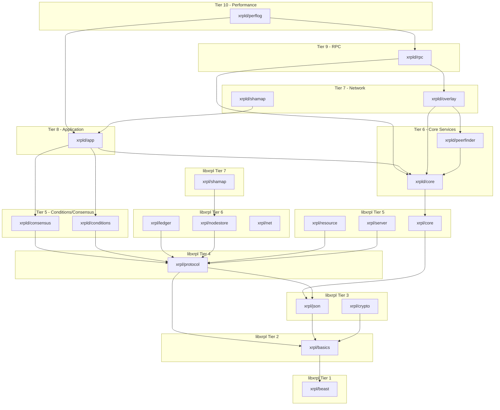
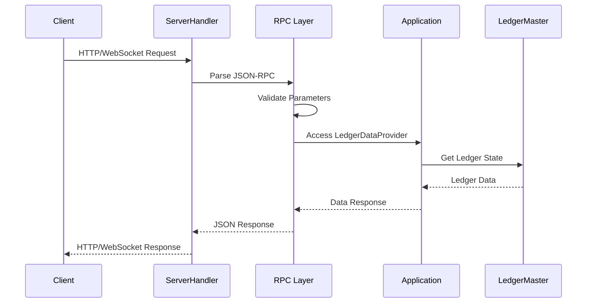
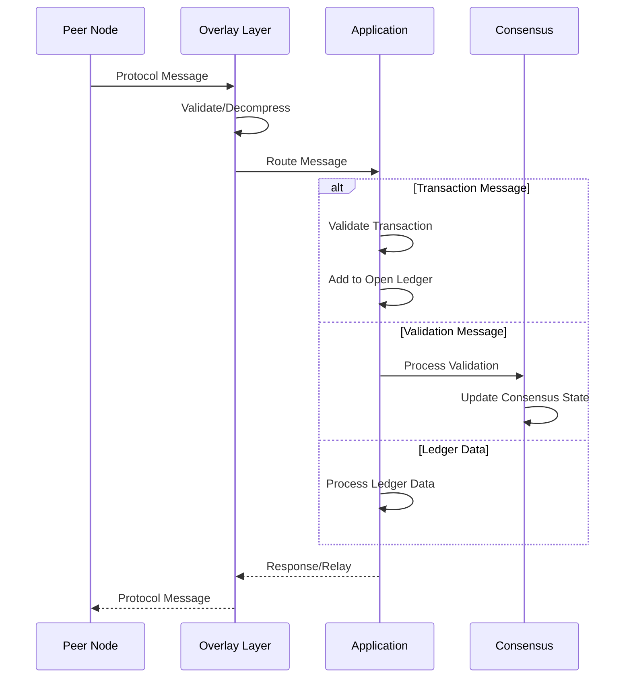

# rippled Architecture Guide

This document provides a comprehensive guide to the rippled codebase architecture for new developers.

## Table of Contents

1. [Overview](#overview)
2. [Module System](#module-system)
3. [Levelization (Dependency Rules)](#levelization-dependency-rules)
4. [Dependency Inversion Patterns](#dependency-inversion-patterns)
5. [Module Responsibilities](#module-responsibilities)
6. [Adding New Features](#adding-new-features)
7. [Testing Architecture](#testing-architecture)
8. [Appendix: Architecture Diagrams](#appendix-architecture-diagrams)

---

## Overview

rippled is the reference server implementation for the XRP Ledger, a decentralized cryptographic ledger. The codebase is written in modern C++ and follows strict architectural principles to maintain modularity, testability, and clear dependency relationships.

### Design Principles

1. **Levelization**: Modules are organized into tiers; higher tiers depend on lower tiers, never the reverse
2. **Separation of Concerns**: Public interfaces (`include/xrpl/`) are separate from implementation (`src/xrpld/`)
3. **Dependency Inversion**: High-level modules depend on abstractions, not concrete implementations
4. **Composition over Inheritance**: Factory functions and composition are preferred over deep inheritance hierarchies

---

## Module System

### Directory Structure

The codebase is organized into two main source areas:

```
rippled/
├── include/xrpl/       # Public headers (library interface)
│   ├── basics/         # Fundamental utilities (logging, types, containers)
│   ├── beast/          # Boost.Beast-derived networking and utilities
│   ├── core/           # Core abstractions (Config, Job, Workers)
│   ├── crypto/         # Cryptographic primitives
│   ├── json/           # JSON parsing and serialization
│   ├── ledger/         # Ledger data structures and views
│   ├── net/            # Network utilities
│   ├── nodestore/      # Key-value persistence layer
│   ├── protocol/       # XRP Ledger protocol types (STObject, transactions)
│   ├── resource/       # Resource management and rate limiting
│   ├── server/         # HTTP/WebSocket server abstractions
│   └── shamap/         # Shared map (Merkle tree) implementation
│
├── src/xrpld/          # Implementation (daemon/server code)
│   ├── app/            # Application layer (transactions, ledger management)
│   ├── conditions/     # Crypto-conditions support
│   ├── consensus/      # Consensus algorithm implementation
│   ├── core/           # Core daemon services
│   ├── overlay/        # Peer-to-peer network layer
│   ├── peerfinder/     # Peer discovery
│   ├── perflog/        # Performance logging
│   ├── rpc/            # JSON-RPC handlers
│   └── shamap/         # SHAMap application extensions
│
└── src/test/           # Test framework and tests
    ├── jtx/            # JSON Transaction test framework
    └── [module]/       # Tests organized by module
```

### libxrpl vs xrpld

| Aspect | libxrpl (`include/xrpl/`, `src/libxrpl/`) | xrpld (`src/xrpld/`) |
|--------|-------------------------------------------|----------------------|
| Purpose | Reusable library components | Application-specific server code |
| Headers | Public API in `include/xrpl/` | Internal headers only |
| Dependencies | Lower-level, minimal | Can depend on libxrpl |
| Reusability | Can be used by external projects | Specific to rippled daemon |

---

## Levelization (Dependency Rules)

### What is Levelization?

Levelization is the practice of organizing modules into hierarchical tiers where:
- **Lower tiers** are more independent (fewer dependencies)
- **Higher tiers** depend on lower tiers
- **Cycles are prohibited** between tiers

This ensures a clean dependency graph, faster compilation, and easier testing.

### Module Tiers

#### libxrpl Modules (Reusable Libraries)

| Level | Module(s) | Description |
|-------|-----------|-------------|
| 01 | `xrpl/beast` | Networking and utility foundations |
| 02 | `xrpl/basics` | Fundamental types and utilities |
| 03 | `xrpl/json`, `xrpl/crypto` | JSON handling, cryptographic primitives |
| 04 | `xrpl/protocol` | XRP Ledger protocol types |
| 05 | `xrpl/core`, `xrpl/resource`, `xrpl/server` | Core services |
| 06 | `xrpl/ledger`, `xrpl/nodestore`, `xrpl/net` | Data storage and networking |
| 07 | `xrpl/shamap` | Merkle tree implementation |

#### xrpld Modules (Application Implementation)

| Level | Module(s) | Description |
|-------|-----------|-------------|
| 05 | `xrpld/conditions`, `xrpld/consensus` | Crypto-conditions, consensus logic |
| 06 | `xrpld/core`, `xrpld/peerfinder` | Daemon core, peer discovery |
| 07 | `xrpld/shamap`, `xrpld/overlay` | Network overlay layer |
| 08 | `xrpld/app` | Application layer (transactions, ledgers) |
| 09 | `xrpld/rpc` | RPC handlers |
| 10 | `xrpld/perflog` | Performance logging |

### Running Levelization Checks

```bash
# Generate levelization analysis
./.github/scripts/levelization/generate.sh

# View any dependency cycles
cat .github/scripts/levelization/results/loops.txt

# View module ordering
cat .github/scripts/levelization/results/ordering.txt
```

### Current Known Cycles

The following cycles exist in the codebase and are being addressed:

| Cycle | Direction | Notes |
|-------|-----------|-------|
| `xrpld.app ↔ xrpld.overlay` | overlay > app | Overlay needs app for message handling |
| `xrpld.app ↔ xrpld.peerfinder` | peerfinder ~= app | Peer discovery integration |
| `xrpld.app ↔ xrpld.rpc` | rpc > app | RPC handlers access application state |
| `test.jtx ↔ test.toplevel` | toplevel > jtx | Test framework dependencies |
| `test.jtx ↔ test.unit_test` | unit_test == jtx | Test utilities |

**Note**: The `>` symbol indicates which module should be at a higher level. The `~=` and `==` symbols indicate unclear ordering.

---

## Dependency Inversion Patterns

rippled uses several patterns to break circular dependencies and improve testability.

### Interface Segregation

Abstract interfaces are defined in lower-tier modules, with concrete implementations in higher tiers.

**Example: LedgerDataProvider**

```cpp
// Lower tier: interface definition (src/xrpld/rpc/LedgerDataProvider.h)
class LedgerDataProvider {
public:
    virtual ~LedgerDataProvider() = default;
    [[nodiscard]] virtual std::shared_ptr<Ledger const> getValidatedLedger() = 0;
    [[nodiscard]] virtual std::shared_ptr<Ledger const> getClosedLedger() = 0;
    [[nodiscard]] virtual LedgerIndex getCurrentLedgerIndex() = 0;
    // ... more methods
};

// Higher tier: implementation (src/xrpld/app/ledger/LedgerMaster.h)
class LedgerMaster : public LedgerDataProvider {
    // Implements all LedgerDataProvider methods
};
```

### Factory Function Pattern

Factory functions (`make_XXX()`) create concrete implementations while allowing callers to depend only on abstract interfaces.

**Examples in codebase:**
- `make_Overlay()` - Creates the peer-to-peer overlay network
- `make_SHAMapStore()` - Creates ledger storage
- `make_LoadManager()` - Creates load management
- `make_ServerHandler()` - Creates HTTP/WebSocket server

**Pattern:**

```cpp
// Declaration in header (lower tier)
std::unique_ptr<Overlay> make_Overlay(
    Application& app,
    Overlay::Setup const& setup,
    Resource::Manager& resourceManager,
    Resolver& resolver,
    boost::asio::io_context& io_context,
    BasicConfig const& config,
    beast::insight::Collector::ptr const& collector);

// Implementation in source file
std::unique_ptr<Overlay> make_Overlay(...) {
    return std::make_unique<OverlayImpl>(...);
}
```

### Composition Root (Application.cpp)

`src/xrpld/app/main/Application.cpp` serves as the **composition root** - the single location where all major components are wired together.

```cpp
// ApplicationImp constructor initializes all subsystems
ApplicationImp(
    std::unique_ptr<Config> config,
    std::unique_ptr<Logs> logs,
    std::unique_ptr<TimeKeeper> timeKeeper)
    : BasicApp(numberOfThreads(*config))
    , config_(std::move(config))
    , logs_(std::move(logs))
    , m_collectorManager(make_CollectorManager(...))
    , m_shaMapStore(make_SHAMapStore(*this, ...))
    , m_resourceManager(Resource::make_Manager(...))
    , m_nodeStore(m_shaMapStore->makeNodeStore(...))
    , m_loadManager(make_LoadManager(*this, ...))
    // ... many more components
{
}
```

This pattern centralizes dependency injection and makes the system's structure explicit.

---

## Module Responsibilities

### Core Modules

| Module | Responsibility |
|--------|----------------|
| `xrpl/basics` | Fundamental utilities: logging (`Journal`), containers (`TaggedCache`), types (`base_uint`), string utilities |
| `xrpl/protocol` | XRP Ledger protocol types: `STObject`, `STTx`, `AccountID`, `Issue`, serialization formats |
| `xrpl/ledger` | Ledger views and iterators: `ReadView`, `ApplyView`, `Sandbox` |
| `xrpld/core` | Daemon services: `Config`, `JobQueue`, `Workers`, database connections |

### Application Modules

| Module | Responsibility |
|--------|----------------|
| `xrpld/app/consensus` | Consensus algorithm: `RCLConsensus`, `RCLValidations` |
| `xrpld/app/ledger` | Ledger management: `LedgerMaster`, `InboundLedgers`, `OpenLedger` |
| `xrpld/app/main` | Application entry point: `Application`, `Main.cpp` |
| `xrpld/app/misc` | Miscellaneous: `NetworkOPs`, `AmendmentTable`, `LoadFeeTrack` |
| `xrpld/app/paths` | Payment pathfinding: `Pathfinder`, `RippleCalc`, `Flow` |
| `xrpld/app/tx` | Transaction processing: `apply()`, `applySteps()`, transactors |

### Network Modules

| Module | Responsibility |
|--------|----------------|
| `xrpld/overlay` | Peer-to-peer networking: `Overlay`, `Peer`, message handling |
| `xrpld/peerfinder` | Peer discovery: finding and managing peer connections |
| `xrpld/rpc` | JSON-RPC API: handlers for all RPC methods |

### Storage Modules

| Module | Responsibility |
|--------|----------------|
| `xrpl/nodestore` | Key-value persistence: backend abstraction, NuDB, RocksDB |
| `xrpl/shamap` | Merkle tree (SHAMap): used for ledger state and transaction sets |

---

## Adding New Features

### Where to Put New Code

| Type of Code | Location | Notes |
|--------------|----------|-------|
| New transaction type | `src/xrpld/app/tx/detail/` | Create a transactor class |
| New RPC handler | `src/xrpld/rpc/handlers/` | Implement handler function |
| Protocol types | `include/xrpl/protocol/` | New SFields, formats |
| Test utilities | `src/test/jtx/` | Extend the jtx framework |

### Adding New Transactions

For detailed guidance on implementing new transactions, see [FEATURE_DEVELOPMENT.md](./FEATURE_DEVELOPMENT.md).

High-level steps:
1. Define new `SField`s in `include/xrpl/protocol/SField.h`
2. Add transaction format in `include/xrpl/protocol/TxFormats.h`
3. Create transactor in `src/xrpld/app/tx/detail/`
4. Register in `src/xrpld/app/tx/applySteps.cpp`
5. Add tests in `src/test/app/`

### Adding New RPC Handlers

1. Create handler file in `src/xrpld/rpc/handlers/`
2. Register in `src/xrpld/rpc/Handlers.cpp`
3. Add tests in `src/test/rpc/`

Example handler structure:

```cpp
Json::Value doMyHandler(RPC::JsonContext& context)
{
    // 1. Validate parameters
    if (!context.params.isMember(jss::account))
        return RPC::missing_field_error(jss::account);

    // 2. Access ledger data through LedgerDataProvider
    auto ledger = context.ledgerDataProvider.getValidatedLedger();

    // 3. Build and return response
    Json::Value result;
    result[jss::status] = jss::success;
    return result;
}
```

---

## Testing Architecture

### Unit Test Framework (jtx)

The `jtx` (JSON Transaction) framework provides a fluent API for testing ledger logic. See `src/test/jtx/README.md` for full documentation.

**Basic Usage:**

```cpp
#include <test/jtx.h>

class MyTest : public beast::unit_test::suite {
    void testExample() {
        using namespace jtx;

        // Create test environment
        Env env(*this);

        // Create and fund accounts
        Account alice("alice");
        Account bob("bob");
        env.fund(XRP(10000), alice, bob);

        // Submit transactions
        env(pay(alice, bob, XRP(100)));

        // Verify state
        env.require(balance(alice, XRP(9900)));
        env.require(balance(bob, XRP(10100)));
    }
};
```

### Test Organization

Tests are organized to mirror the source structure:

| Test Directory | Tests For |
|----------------|-----------|
| `src/test/app/` | Transaction processing, application logic |
| `src/test/rpc/` | RPC handlers |
| `src/test/ledger/` | Ledger views and operations |
| `src/test/protocol/` | Protocol types and serialization |
| `src/test/consensus/` | Consensus algorithm |
| `src/test/overlay/` | Peer-to-peer networking |
| `src/test/nodestore/` | Storage backends |

### Running Tests

```bash
# Build with tests
cmake -B build -DCMAKE_BUILD_TYPE=Debug
cmake --build build -j$(nproc)

# Run all unit tests
./build/rippled --unittest

# Run specific test suite
./build/rippled --unittest=Payment_test

# Run with verbose output
./build/rippled --unittest --unittest-log
```

---

## Appendix: Architecture Diagrams

### Module Dependency Hierarchy



### Request Flow (RPC)



### Request Flow (P2P)



---

## Further Reading

- [CONTRIBUTING.md](../CONTRIBUTING.md) - Contribution guidelines
- [FEATURE_DEVELOPMENT.md](./FEATURE_DEVELOPMENT.md) - Detailed feature implementation guide
- [src/test/jtx/README.md](../src/test/jtx/README.md) - Test framework documentation
- [.github/scripts/levelization/README.md](../.github/scripts/levelization/README.md) - Levelization tooling

