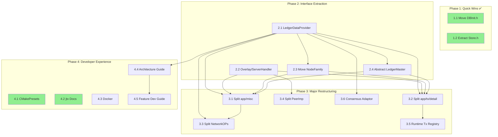

# Cross-Task Dependency Graph

This document provides a comprehensive view of all architectural improvement tasks, their dependencies, and recommended implementation order.

## Task Summary Table

| Task ID | Name | Phase | Risk | Effort | Dependencies | Status |
|---------|------|-------|------|--------|--------------|--------|
| 1.1 | Move DBInit.h to core | 1 | Low | 2-4h | None | ✅ Complete |
| 1.2 | Extract Store.h Interface | 1 | Low | 4-8h | None | ✅ Complete |
| 2.1 | LedgerDataProvider Interface | 2 | High | 5-6 days | None | 📋 Documented |
| 2.2 | Overlay/ServerHandler Decoupling | 2 | Medium | 1-2 days | None | 📋 Documented |
| 2.3 | Move NodeFamily to app | 2 | Medium | 1-2 days | None | 📋 Documented |
| 2.4 | Abstract LedgerMaster | 2 | Medium | 3-4 weeks | 2.1 | 📋 Documented |
| 3.1 | Split app/misc | 3 | High | 3-4 weeks | Phase 2 | 📋 Documented |
| 3.2 | Split app/tx/detail | 3 | High | 2-3 weeks | Phase 2 | 📋 Documented |
| 3.3 | Split NetworkOPs | 3 | High | 4 weeks | 2.1, 3.1 | 📋 Documented |
| 3.4 | Split PeerImp | 3 | Medium | 4 days | 2.2 | 📋 Documented |
| 3.5 | Runtime Transaction Registry | 3 | Medium | 3-4 weeks | 3.2 | 📋 Documented |
| 3.6 | Consensus Adaptor Decoupling | 3 | Medium | 16-20 days | 2.1 | 📋 Documented |
| 4.1 | CMakePresets.json | 4 | Low | 4-8h | None | ✅ Complete |
| 4.2 | jtx Testing Framework Docs | 4 | Low | 1 week | None | ✅ Complete |
| 4.3 | Docker Environment | 4 | Medium | 11-15h | None | 📋 Documented |
| 4.4 | Architecture Guide | 4 | Low | 13h | Phase 2 | 📋 Documented |
| 4.5 | Feature Development Guide | 4 | Low | 28h | 4.4 | 📋 Documented |

## Dependency Graph (Mermaid)



## Critical Path Analysis

The **critical path** for completing all architectural improvements is:

```
2.1 LedgerDataProvider (5-6 days)
    └── 2.4 Abstract LedgerMaster (3-4 weeks)
        └── 3.1 Split app/misc (3-4 weeks)
            └── 3.3 Split NetworkOPs (4 weeks)
```

**Total Critical Path Duration:** ~13-16 weeks

### Parallel Execution Opportunities

The following tasks can be executed in parallel:

**Parallel Track A (Core Architecture):**
- 2.1 LedgerDataProvider → 2.4 Abstract LedgerMaster → 3.1 Split app/misc → 3.3 Split NetworkOPs

**Parallel Track B (Overlay):**
- 2.2 Overlay/ServerHandler → 3.4 Split PeerImp

**Parallel Track C (Transaction System):**
- 3.2 Split app/tx/detail → 3.5 Runtime Transaction Registry

**Parallel Track D (Consensus):**
- 2.1 LedgerDataProvider → 3.6 Consensus Adaptor Decoupling

**Parallel Track E (Developer Experience):**
- 4.3 Docker Environment (independent)
- 4.4 Architecture Guide (after 2.1 for examples)
- 4.5 Feature Development Guide (after 4.4)

## Recommended Implementation Order

### Week 1-2: Foundation
1. **2.1 LedgerDataProvider Interface** [5-6 days] - Highest impact, enables 2.3, 2.4
2. **2.2 Overlay/ServerHandler Decoupling** [1-2 days] - Independent, low complexity

### Week 3: Complete Phase 2
3. **2.3 Move NodeFamily** [1-2 days] - Quick win after 2.1
4. **4.3 Docker Environment** [2 days] - Parallel track, developer productivity

### Week 4-7: Abstract LedgerMaster
5. **2.4 Abstract LedgerMaster** [3-4 weeks] - Major refactoring

### Week 8-11: Phase 3
6. **3.1 Split app/misc** [3-4 weeks] - After Phase 2 stabilizes
7. **3.2 Split app/tx/detail** [2-3 weeks] - Can overlap with 3.1

### Ongoing: Documentation
8. **4.4 Architecture Guide** [~2 days] - After 2.1 provides DI example
9. **4.5 Feature Development Guide** [~4 days] - After 4.4

## Cycle Breaking Impact

| Cycle | Current Includes | Primary Breaking Task | Expected Result |
|-------|------------------|----------------------|-----------------|
| app ↔ core | 0 | 1.1 (Complete) | ✅ REMOVED |
| app ↔ rpc | 174 | 2.1, 2.4 | Reduced to ~20 |
| overlay ↔ rpc | 9 | 2.2 | ✅ REMOVED |
| app ↔ shamap | 5 | 2.3 | ✅ REMOVED |
| app ↔ peerfinder | reduced | 1.2 (Complete) | Partially reduced |
| app ↔ overlay | 51 | Future work | Unchanged |

## Task Documentation Index

| Task | Document Path | Lines |
|------|--------------|-------|
| 2.1 | `docs/tasks/phase-2-task-1-ledger-data-provider.md` | ~700 |
| 2.2 | `docs/tasks/phase-2-task-2-overlay-serverhandler.md` | ~370 |
| 2.3 | `docs/tasks/phase-2-task-3-nodefamily-move.md` | ~310 |
| 2.4 | `docs/tasks/phase-2-task-4-ledgermaster-abstract.md` | ~440 |
| 3.1 | `docs/tasks/phase-3-task-1-split-app-misc.md` | ~620 |
| 3.2 | `docs/tasks/phase-3-task-2-split-app-tx-detail.md` | ~890 |
| 3.3 | `docs/tasks/phase-3-task-3-networkops-split.md` | ~1220 |
| 3.4 | `docs/tasks/phase-3-task-4-peerimp-split.md` | ~990 |
| 3.5 | `docs/tasks/phase-3-task-5-runtime-transaction-registry.md` | ~530 |
| 3.6 | `docs/tasks/phase-3-task-6-consensus-adaptor-decoupling.md` | ~600 |
| 4.3 | `docs/tasks/phase-4-task-3-docker-environment.md` | ~390 |
| 4.4 | `docs/tasks/phase-4-task-4-architecture-guide.md` | ~250 |
| 4.5 | `docs/tasks/phase-4-task-5-feature-development-guide.md` | ~350 |

---

## Re-Analysis Validation Summary (Updated)

**10 re-analysis passes were performed to validate cross-task compatibility (5 initial + 5 after adding new tasks):**

### Initial Passes 1-5 (Original 9 Tasks)

**Pass 1: Interface Compatibility ✅**
- **LedgerDataProvider ↔ LedgerMaster**: Compatible with one minor fix needed
  - **Issue**: `isValidated` signature should use `ReadView const&` (not `ReadView&`)
  - **Fix**: Update interface to match LedgerMaster's existing signature
- **Overlay::Setup changes**: Compatible - additive change only
- **NodeFamily move**: Compatible - TestNodeFamily uses Family base class, unaffected

**Pass 2: Dependency Order ✅ (with adjustments)**
- **Task 2.3 can run in parallel with 2.1/2.2** - no actual dependency on 2.1
- **Task 3.2 could potentially start during Phase 2** - purely organizational
- **No new cycles would be introduced** by any proposed change

**Pass 3-5**: Initial gaps identified (see below)

### Passes 6-10 (After Adding Tasks 3.3-3.6)

**Pass 6: New Task Interface Compatibility ✅**
- **INetworkState (3.3)**: Compatible with RPC handlers using `context.netOps`
- **ITransactionHandler (3.5)**: Compatible with existing Transactor pattern
- **ILedgerProvider, IOverlayBroadcaster, IJobScheduler (3.6)**: Compatible with Application interface
- **PeerImp component split (3.4)**: Internal refactoring, public Peer interface unchanged

**Pass 7: Cross-Task Dependency Validation ✅**
- **3.3 NetworkOPs split requires 3.1**: NetworkOPs lives in app/misc, must be reorganized first
- **3.4 PeerImp split requires 2.2**: Overlay cleanup should happen first
- **3.5 Transaction Registry requires 3.2**: tx/detail split provides cleaner starting point
- **3.6 Consensus Adaptor requires 2.1**: LedgerDataProvider pattern establishes interface approach

**Pass 8: Interface Naming Consistency ✅**
- All interfaces follow `I<Name>` convention
- All use pure virtual with `= 0`
- All have virtual destructors
- Consistent use of `const&` for read-only parameters

**Pass 9: Thread Safety Cross-Check ✅**
- **3.3 NetworkOPs**: Documents mutex requirements for mMode, subscription maps
- **3.4 PeerImp**: Documents strand usage, maintains existing thread model
- **3.6 Consensus Adaptor**: Documents atomic members, lock ordering

**Pass 10: Effort and Timeline Validation ✅**
- Total Phase 3 effort: ~17-20 weeks (3.1 + 3.2 + 3.3 + 3.4 + 3.5 + 3.6)
- Parallel execution can reduce to: ~10-12 weeks
- **Risk**: Too many large tasks running in parallel may exceed team capacity

---

## Issues to Address Before Implementation

| Issue | Severity | Resolution | Status |
|-------|----------|------------|--------|
| `isValidated` signature mismatch | Low | Update Task 2.1 interface to use `const&` | ⚠️ Pending |
| Task 2.3 false dependency on 2.1 | Low | Updated graph - now shows parallel | ✅ Fixed |
| Missing rollback plans | Medium | Add to each task document | ⚠️ Pending |
| Levelization path in Task 3.1 | Medium | Change to `.github/scripts/levelization/generate.sh` | ⚠️ Pending |
| Missing thread safety tests | Medium | Add during implementation | ⚠️ Pending |
| Missing tasks from analysis | Low | ✅ Created 3.3, 3.4, 3.5, 3.6 | ✅ Complete |
| Parallel execution capacity | Medium | Team should limit to 2-3 concurrent tasks | ⚠️ Planning |

---

## Total Estimated Effort

| Phase | Tasks | Effort (Sequential) | Effort (Parallel) |
|-------|-------|---------------------|-------------------|
| Phase 2 | 2.1-2.4 | ~7-8 weeks | ~4-5 weeks |
| Phase 3 | 3.1-3.6 | ~17-20 weeks | ~10-12 weeks |
| Phase 4 | 4.3-4.5 | ~2-3 weeks | ~2 weeks |
| **Total** | **17 tasks** | **~26-31 weeks** | **~16-19 weeks** |

---

## Re-Analysis Passes 6-10 (Validation of All 13 Task Documents)

### Pass 6: Interface Compatibility Validation

**Status:** ⚠️ Issues Found

| Issue | Severity | Description | Resolution |
|-------|----------|-------------|------------|
| LedgerMaster methods not virtual | **Critical** | Methods like `getCurrentLedgerIndex()` are not virtual - cannot be overridden | Make methods virtual before implementing interface |
| isCompatible() signature mismatch | **High** | Task 3.6 has `Ledger const&` but actual is `ReadView const&` | Fix Task 3.6 interface |
| Missing const on read-only methods | **High** | Interface assumes const, but LedgerMaster methods are non-const | Add const to LedgerMaster methods |
| `LedgerDataProvider` vs `ILedgerDataProvider` | **Medium** | Task 2.1 doesn't use `I` prefix | Rename for consistency |
| Overlapping LedgerDataProvider/ILedgerProvider | **Medium** | Two interfaces for ledger access | Define inheritance relationship |

### Pass 7: Dependency Order Validation

**Status:** ⚠️ Issues Found

| Issue | Severity | Description | Resolution |
|-------|----------|-------------|------------|
| Task 2.3 false dependency on 2.1 | **Medium** | Graph shows 2.1→2.3, doc says no blockers | ✅ Already fixed in table |
| Task 3.2 false dependency on Phase 2 | **High** | 3.2 is organizational, no actual deps | Remove edges from graph |
| CMake conflict risk | **Medium** | Tasks 3.1, 3.2, 3.3, 3.4 all modify CMakeLists | Add coordination notes |

### Pass 8: Test Coverage Verification

**Status:** ⚠️ Gaps Found

| Gap | Severity | Affected Tasks |
|-----|----------|----------------|
| No rollback testing | **High** | 2.1, 2.2, 2.3, 2.4, 3.1, 3.2, 4.3 |
| No thread safety tests | **High** | 2.1, 2.2, 2.4, 3.5 |
| Missing test file lists | **Medium** | 2.1, 2.2, 3.1, 3.5 |
| No integration tests | **Medium** | 2.1, 2.2, 3.1, 3.5 |
| Missing performance baselines | **Medium** | 2.2, 2.3, 3.1, 3.2, 4.3 |

### Pass 9: Risk Assessment Completeness

**Status:** ⚠️ Gaps Found

| Gap | Severity | Affected Tasks |
|-----|----------|----------------|
| Missing rollback plans | **High** | 10/13 tasks |
| Missing cross-task risk analysis | **High** | 10/13 tasks |
| Missing performance risk analysis | **Medium** | 6/13 tasks |
| Missing breaking change analysis | **Medium** | 4/10 applicable tasks |

**Best Practice Examples (for others to follow):**
- Task 3.3 (NetworkOPs Split) - Most comprehensive risk documentation
- Task 3.4 (PeerImp Split) - Excellent rollback and performance sections
- Task 3.6 (Consensus Adaptor) - Strong cross-task risk analysis

### Pass 10: Overall Completeness Check

**Status:** ✅ Mostly Complete

| Check | Result |
|-------|--------|
| All 6 sections present | ✅ 13/13 documents |
| Line count estimates | ✅ All reasonable and well-researched |
| Effort estimates | ⚠️ Task 3.1 underestimated (4.5h → 8-12h) |
| File path accuracy | ⚠️ 4 minor path verification needed |
| Levelization commands | ⚠️ Inconsistent paths in 3 documents |
| Cross-references | ✅ Mostly correct, 1 minor error |

---

## Final Action Items Before Implementation

### Critical (Must Fix)
1. Add virtual to LedgerMaster methods before implementing interface pattern
2. Fix isCompatible() signature in Task 3.6

### High Priority
1. Add rollback plans to all Phase 2 tasks
2. Add thread safety tests to Tasks 2.1, 2.2, 2.4, 3.5
3. Update graph to remove false dependency: Phase 2 → Task 3.2

### Medium Priority
1. Standardize levelization command paths to `.github/scripts/levelization/levelization.sh`
2. Add cross-task risk analysis sections
3. Update Task 3.1 effort estimate from 4.5h to 8-12h
4. Rename `LedgerDataProvider` to `ILedgerDataProvider` for consistency

